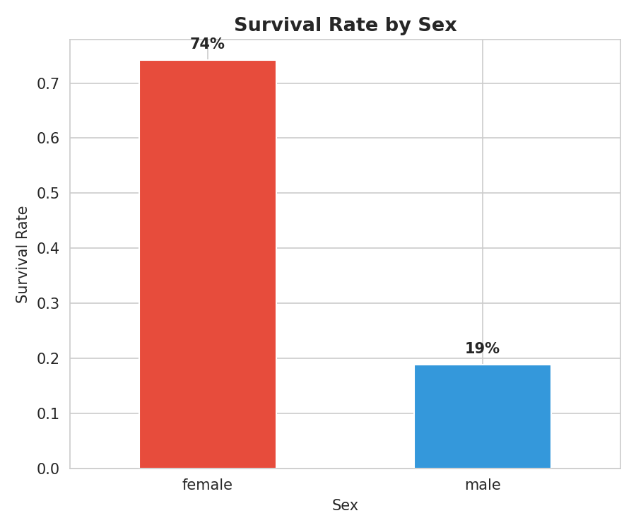
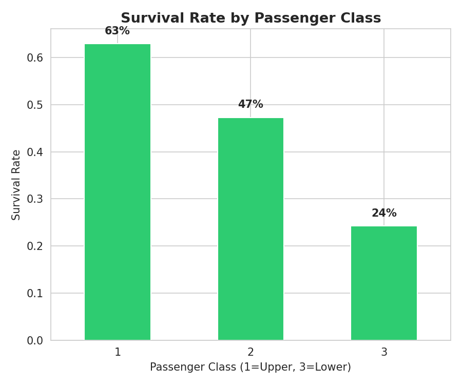
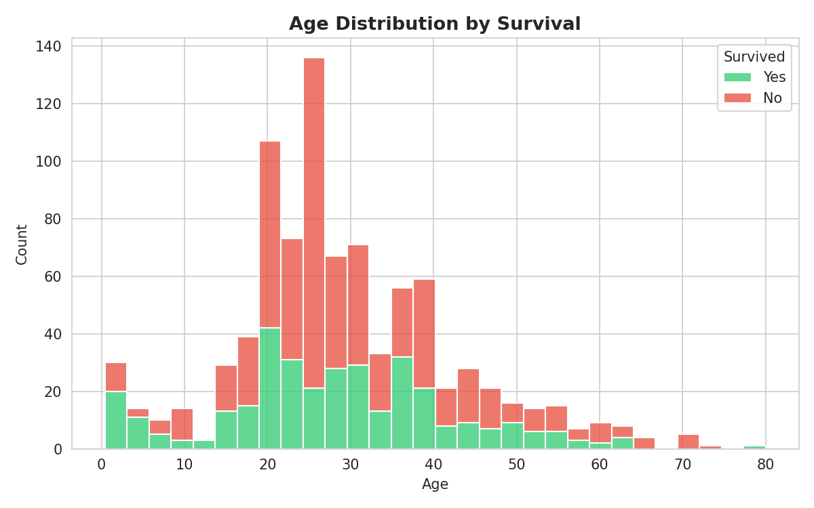
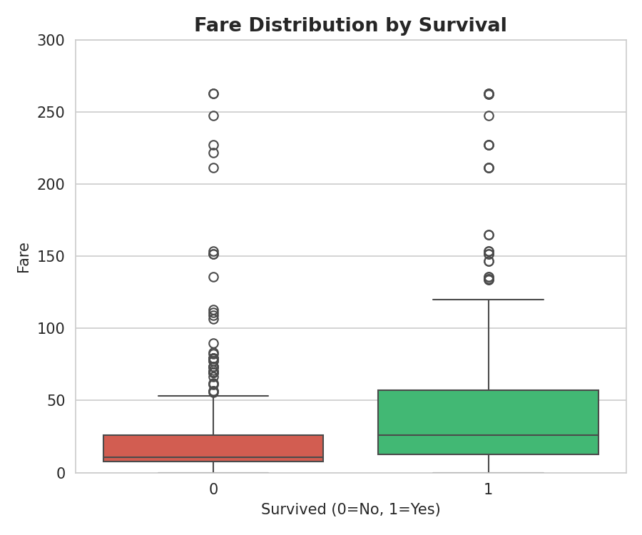
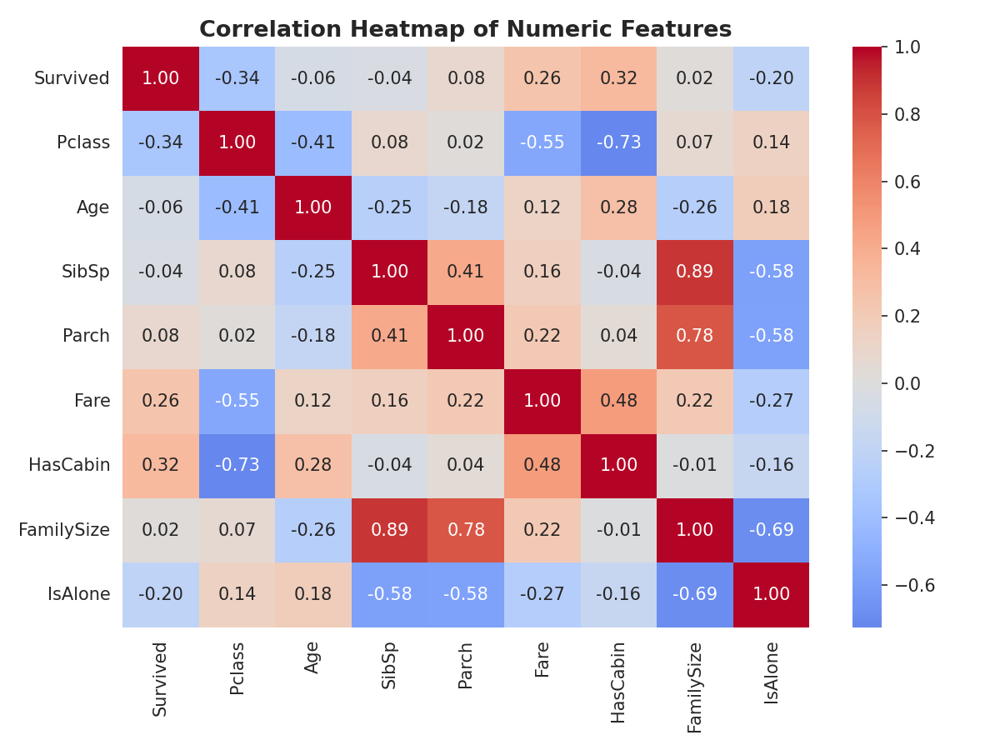
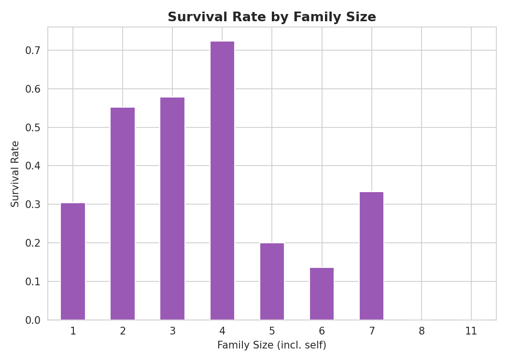

# Task 2: Titanic Dataset — Data Cleaning & Exploratory Data Analysis

## 📌 Overview
This project is **Task 2** of my Data Science Virtual Internship. The goal was to perform data cleaning and exploratory data analysis (EDA) on the Titanic dataset from Kaggle, exploring relationships between passenger variables and survival outcomes.

## 📊 Charts

### Survival Rate by Sex

### Survival Rate by Passenger Class

### Age Distribution by Survival

### Fare Distribution by Survival

### Correlation Heatmap

### Survival Rate by Family Size

## 🛠️ Tools Used
- Python (pandas, matplotlib, seaborn)
- Jupyter Notebook

## 🔍 Data Cleaning Steps
- **Age** (177 missing): filled using median age grouped by `Pclass` + `Sex`
- **Embarked** (2 missing): filled with the mode (most common port)
- **Cabin** (687 missing, 77%): too sparse to impute — converted into a binary `HasCabin` feature instead of dropping entirely
- Dropped non-predictive identifier columns: `PassengerId`, `Ticket`, `Name`
- Engineered new features: `FamilySize` (SibSp + Parch + 1) and `IsAlone`

## 💡 Key Findings
- **Sex** was the strongest predictor of survival: women survived at **74%**, men at only **19%**
- **Passenger class** mattered significantly: 1st class survival was **63%** vs **24%** in 3rd class
- **Younger passengers** had a higher survival share than older passengers
- **Survivors paid higher average fares**, reflecting the class-survival link
- **Small families (2-4 people)** survived more than solo travelers or very large families
- Strongest numeric correlations with survival: `Pclass` (-0.34) and `HasCabin` (+0.32)

## 📁 Files in this Repo
| File | Description |
|------|-------------|
| `Titanic_EDA.ipynb` | Full Jupyter notebook with cleaning + EDA code |
| `train.csv` | Original raw dataset |
| `train_cleaned.csv` | Cleaned dataset after preprocessing |
| `chart1-6_*.png` | EDA visualizations |
| `README.md` | Project documentation (this file) |

## 🎯 Task Requirement
> Perform data cleaning and exploratory data analysis (EDA) on a dataset of your choice, such as the Titanic dataset from Kaggle. Explore the relationships between variables and identify patterns and trends in the data.

---
🔗 Part of my Data Science Virtual Internship series.
